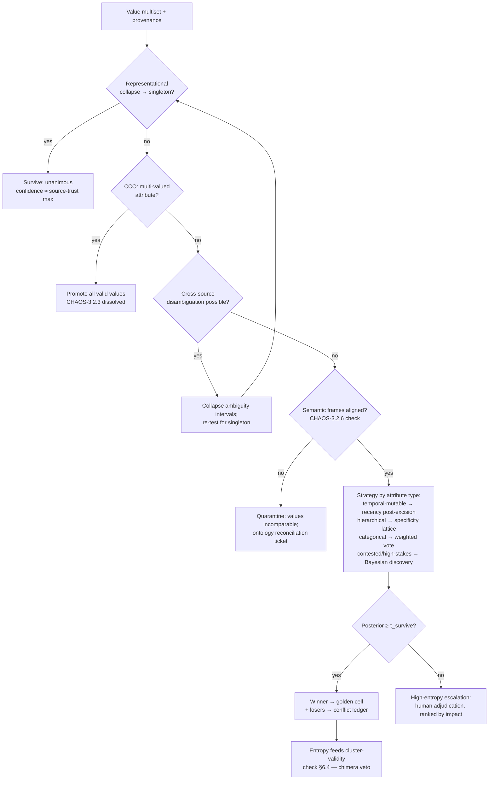

# ALGORITHMIC_ARCHITECTURE_AND_SSOT_BLUEPRINT.md
## SchemaPilot — Phase 2: The Core Mission & Algorithmic Engine Blueprint
### From Scattered, Contradictory Scrap Metal to Pure Gold Bullion: The Single Source of Truth Engine

| Document Control | |
|---|---|
| **Artifact** | FILE_2 — Algorithmic Architecture & SSOT Blueprint |
| **Status** | Foundational Specification (Pre-Implementation; no execution code) |
| **Dependency** | FILE_1 — every countermeasure herein cites the `CHAOS-x.y.z` classes it neutralizes |
| **Design Targets** | Tier-1 scale (10⁸–10¹⁰ rows, 10–500 sources), 99.99% certified-field trust, full reversibility, full lineage |

---

## 0. Design Axioms (Non-Negotiable Architectural Law)

Every layer of the engine is governed by eight axioms. Any implementation decision that violates one of these is, by definition, wrong:

| # | Axiom | Rationale (FILE_1 citation) |
|---|---|---|
| A1 | **Immutability of the raw.** Source data is never mutated; all cleaning is a *derivation* with a recorded transform chain. | `CHAOS-4.2.3` — cleaning without receipts is unrecoverable |
| A2 | **Evidence pluralism.** No decision (mapping, merge, survival) rests on a single evidence channel. Labels lie (`CHAOS-1.1.7`), values lie (`CHAOS-3.2.4`), timestamps lie (`CHAOS-2.1.7`); only their *agreement* approaches truth. |
| A3 | **Confidence is a first-class datum.** Every cell in the SSOT carries a calibrated confidence score and a provenance pointer. An answer without confidence is not an answer. |
| A4 | **Strict decontamination ordering.** Syntactic repair precedes semantic comparison precedes truth discovery. Encoding repair *must* precede entity resolution; sentinel neutralization *must* precede recency-based fusion. (`CHAOS-2.2.x → 3.1.x`; `CHAOS-2.1.7 → fusion inversion`, FILE_1 §5) |
| A5 | **Asymmetric error costs.** A false merge (chimera, `CHAOS-3.2.7`) is strictly worse than a false split. The engine biases toward splitting under uncertainty; merges require super-threshold evidence. |
| A6 | **Conflict is information.** Disagreement between sources is never discarded; it is measured (entropy), used (source-reliability estimation), retained (conflict ledger), and fed back (merge-validity checking). |
| A7 | **Human adjudication is a routed resource, not a fallback.** The engine computes exactly which decisions have the highest (uncertainty × impact) product and spends scarce human attention there — never on what the machine can decide, always on what it can't. |
| A8 | **Idempotency & determinism.** Re-running the pipeline on identical inputs yields byte-identical SSOT output. All stochastic components (sampling, LSH seeds, model versions) are pinned and versioned. Without this, no audit is possible. |

---

## 1. Macro-Architecture: The Seven-Layer Refinery

```mermaid
graph TB
    subgraph L0["LAYER 0 — INGESTION & RAW VAULT"]
        A0[Source connectors] --> A1[Provenance envelope wrapping]
        A1 --> A2[(Immutable Raw Vault<br/>content-addressed, append-only)]
    end
    subgraph L1["LAYER 1 — PROFILING & FINGERPRINTING"]
        B1[Type inference census] --> B2[Statistical fingerprints<br/>sketches: HLL, KMV, CMS]
        B2 --> B3[Anomaly pre-scan &<br/>chaos-class detection]
    end
    subgraph L2["LAYER 2 — SCHEMA ALIGNMENT"]
        C1[Deterministic matcher<br/>ontology + dictionaries] --> C3[Evidence combiner]
        C2[Probabilistic matcher<br/>embeddings + instance evidence] --> C3
        C3 --> C4[Global assignment solver]
        C4 --> C5{Confidence gate}
    end
    subgraph L3["LAYER 3 — SYNTACTIC STANDARDIZATION"]
        D1[Encoding repair] --> D2[Unicode & script normalization]
        D2 --> D3[Temporal resolution engine]
        D3 --> D4[Numeric/unit/categorical<br/>canonicalization]
        D4 --> D5[Null pantheon unification &<br/>sentinel neutralization]
    end
    subgraph L4["LAYER 4 — ENTITY RESOLUTION"]
        E1[Blocking & indexing<br/>LSH / sorted-neighborhood / canopies] --> E2[Pairwise comparison vectors]
        E2 --> E3[Match classification<br/>Fellegi–Sunter / learned]
        E3 --> E4[Graph clustering &<br/>chimera guards]
    end
    subgraph L5["LAYER 5 — CONFLICT RESOLUTION & FUSION"]
        F1[Conflict detection & typing] --> F2[Per-attribute resolution policies]
        F2 --> F3[Bayesian truth discovery ⇄<br/>source reliability estimation]
        F3 --> F4[Golden record assembly]
    end
    subgraph L6["LAYER 6 — VALIDATION, CERTIFICATION & SSOT"]
        G1[Constraint engine<br/>row + population grain] --> G2[Reconciliation against sources]
        G2 --> G3[Trust scoring & certification]
        G3 --> G4[(SSOT: Golden Records +<br/>Crosswalk + Conflict Ledger +<br/>Lineage Graph)]
    end
    A2 --> B1
    B3 --> C1
    B3 --> C2
    C5 -- "pass" --> D1
    C5 -- "ambiguous" --> H1[Human adjudication queue]
    H1 --> C3
    D5 --> E1
    E4 --> F1
    F4 --> G1
    E4 -- "conflict magnitude<br/>feedback (A6)" --> E3
    G3 -- "reliability priors<br/>feedback" --> F3
```



Two structural properties of this topology deserve explicit statement:

1. **It is a refinery, not a filter.** Material is never discarded — it is graded. Rows that fail a layer are not dropped; they are quarantined with a reason code, remain queryable, and remain candidates for re-processing when the engine improves (A1).
2. **It contains two deliberate feedback cycles** (dashed logic above): conflict magnitude feeding back into match classification (anti-chimera, A5/A6), and certified-output reconciliation feeding back into source reliability priors (the engine learns which sources to trust *from its own outcomes*).

---

## 2. Layer 0 — Ingestion & The Provenance Envelope

Every inbound record is wrapped, before anything else touches it, in a **provenance envelope**:

```
ProvenanceEnvelope {
    source_system_id        // stable registry key for the silo
    source_file_id          // content hash (SHA-256) of the carrier file
    extraction_timestamp    // when WE pulled it (trusted clock)
    source_asserted_time    // what the SOURCE claims (untrusted; CHAOS-2.1.9)
    declared_encoding       // what the source claims; verified later vs detected
    declared_locale         // drives date/number disambiguation priors (L3)
    declared_timezone       // restores what CSV export destroyed (CHAOS-2.1.8)
    schema_version_hash     // detects structural drift (CHAOS-1.2.3)
    row_ordinal             // position in carrier — needed for positional-shift forensics
    batch_id                // detects re-ingestion duplication (CHAOS-1.3.9/1.3.10)
}
```

Design consequences:

- **Content addressing kills re-ingestion at the gate.** A re-uploaded file hashes identically → `CHAOS-1.3.9` neutralized *before* it can stuff the ballot box of Layer-5 voting. Overlapping extraction windows (`CHAOS-1.3.10`) are caught by `(source_system_id, natural_key, source_asserted_time)` collision detection at staging.
- **Schema-version hashing converts structural drift from silent corruption into an explicit event.** When a monthly feed's column census changes (count, names, inferred types, positions), ingestion raises a *schema drift event* and routes the new shape through Layer 2 re-alignment instead of appending positionally (`CHAOS-1.2.3` — the inserted-middle-column shear becomes impossible by construction).
- **Locale and timezone declarations are priors, not truths.** They seed Layer 3 disambiguation but are themselves validated against the data (a "US-locale" file whose dates contain day>12 in the first position falsifies its own declaration).

---

## 3. Layer 1 — The Profiling Engine: Statistical Fingerprinting

Before any matching or cleaning, every column in every source is reduced to a **fingerprint** — a compact statistical identity that powers schema matching (L2), type repair (L3), blocking-key selection (L4), and anomaly detection (L6). At tier-1 scale, fingerprints are computed in one streaming pass using sublinear sketches:

| Fingerprint Component | Structure | Powers |
|---|---|---|
| Cardinality estimate | HyperLogLog (±1–2% at KBs of memory) | Key detection, join-fan-out prediction (`CHAOS-4.1.1` pre-warning), categorical vs free-text discrimination |
| Frequency skeleton | Count-Min Sketch + top-k heavy hitters | Sentinel discovery (`CHAOS-1.4.2`: a numeric column where `9999` holds 11% mass is self-incriminating), category census (`CHAOS-2.3.4`) |
| Value-set signature | K-Minimum-Values / MinHash signature | **Cross-file instance overlap** — the decisive evidence channel for schema matching (§4.3) and FK discovery, computable source×source without full joins |
| Distribution sketch | t-digest (quantiles), histogram | Numeric range plausibility, distribution-similarity matching, drift detection between loads |
| Pattern census | Regex-class histogram over a stratified sample (`\d{4}-\d{2}-\d{2}`: 61%, `\d{2}/\d{2}/\d{4}`: 38%, other: 1%) | Format-mixture detection (`CHAOS-2.1.1`), type pollution quantification (`CHAOS-1.4.x`) |
| Script/charset census | Per-character Unicode block distribution | Mojibake signatures (`CHAOS-2.2.1`: Arabic-presentation bytes rendered as Latin-1 punctuation salad have an unmistakable block profile), mixed-digit detection (`CHAOS-2.2.6`/`1.4.7`) |
| Type-inference vector | P(type) over {int, decimal, date, bool, id-like, free-text, …} from value-level voting | The *probabilistic* type of the column — note: a vector, not a verdict, because polluted columns genuinely have mixed type mass |
| Null census (typed) | Counts per null-pantheon member (`CHAOS-2.4.1`) | Missingness typing for L3 and for honest denominators everywhere |
| Benford / temporal pulse profile | First-digit distribution; timestamp sub-second & midnight-mass profile | Fabrication and truncation signatures (`CHAOS-3.4.4`) |

**The chaos pre-scan.** Fingerprints are pattern-matched against the FILE_1 taxonomy to produce a per-source **Chaos Manifest** — a machine-readable declaration like *"column 7: 92% ISO dates, 8% ambiguous slash-dates, sentinel `1900-01-01` at 4% mass, NBSP contamination in 0.3% of values"*. The manifest is what the flow controller (§8) routes on: it is how the engine knows, before spending compute, whether a column is a clean fast-path vector or a deep-path hazard.

---

## 4. Layer 2 — Deterministic & Probabilistic Schema Matching

**Mission:** map every source column to a node in the **Canonical Concept Ontology (CCO)** — the enterprise's master attribute graph (`person.name.mother`, `person.contact.phone[]`, `txn.amount{currency}`) — or explicitly to `UNMAPPED` (never to a guess). Targets `CHAOS-1.1.1–1.1.9`.

### 4.1 The Canonical Concept Ontology

The CCO is a typed graph, not a flat list:

- **Concept nodes** carry: canonical name, datatype contract, unit contract, validation predicates, multiplicity (single vs multi-valued — the structural answer to `CHAOS-3.2.3`), sensitivity class (PII/erasable, for the GDPR trap in `CHAOS-2.4.1`).
- **Label edges:** every attested surface label ever mapped, across all languages (`Mother_Name`, `MTH_NM`, `اسم الوالدة`, `Nom_de_la_Mère`), each with its provenance and a reliability weight. The ontology *accretes* — every adjudicated mapping permanently enriches it, so matching accuracy is monotonically increasing over the engine's lifetime.
- **Composition edges:** `person.name.full ⇄ {person.name.first, person.name.last}` with declared split/join functions — making 1:N correspondences (`CHAOS-1.1.8`) first-class rather than a special case.

### 4.2 Stage A — The Deterministic Matcher

Cheap, exact, high-precision; runs first to drain the easy mass:

1. **Label normalization:** Unicode-normalize (NFC) → strip BOM/zero-width (`CHAOS-2.2.4/2.2.7` apply to headers too) → casefold → tokenize on case/delimiter boundaries (`motherName`→`mother name`) → abbreviation expansion via curated dictionary (`MTH→mother`, `NM→name`) → stemming.
2. **Multilingual canonical lookup:** normalized label → translation/synonym tables → CCO label-edge exact match.
3. **Output:** candidate mapping with score 1.0 **but flagged `HOMONYM-UNVERIFIED`** — per A2, *no label match is final until instance evidence concurs* (§4.3). This is the structural defense against `CHAOS-1.1.7`: the deterministic matcher is allowed to nominate, never to decide alone.

### 4.3 Stage B — The Probabilistic Matcher (Evidence Channels)

For unmatched columns — and for *verifying* every Stage-A nomination — four independent evidence channels are computed between source column *c* and each candidate CCO concept *k*:

| Channel | Computation | What it catches |
|---|---|---|
| **E₁ — Label semantic similarity** | Multilingual sentence-embedding of the normalized label vs embeddings of all CCO label-edges; cosine similarity, max-pooled. Cross-lingual embedding space is what makes `اسم الوالدة ≈ Mother_Name` computable *without* translation. | Synonymy, cross-lingual labels (`CHAOS-1.1.1/1.1.2`) |
| **E₂ — Type & pattern compatibility** | Fingerprint type-vector (L1) vs concept datatype contract; pattern census vs concept's attested pattern library. Hard incompatibility (label says "name", values are 99% numeric) drives the score *negative* — a veto channel. | Homonyms (`CHAOS-1.1.7`), positional anonymity (`CHAOS-1.1.6`) |
| **E₃ — Distributional similarity** | For numerics: quantile-sketch distance (Kolmogorov–Smirnov statistic over t-digests). For categoricals: Jensen–Shannon divergence between frequency skeletons. Compared against the pooled distribution of columns already mapped to *k*. | Same-typed different-concepts (age vs shoe-size are both small ints but distribute differently) |
| **E₄ — Instance overlap (the heavyweight)** | KMV/MinHash signature resemblance between *c*'s value set and the union value-set of columns already mapped to *k*: estimated Jaccard containment. Two columns sharing 70% of normalized values are the same concept regardless of what their labels claim. | Everything labels can't prove; the decisive channel for `CHAOS-1.1.5` mangled headers and `1.1.6` anonymous columns |

**Composite score** — a calibrated log-linear combination:

```
S(c,k) = σ( w₁·E₁ + w₂·E₂ + w₃·E₃ + w₄·E₄ + w₅·𝟙[deterministic hit] + bₖ )
```

with weights fit on the accumulated corpus of adjudicated mappings (the ontology's memory) and recalibrated per release; channel availability is explicit — when a concept has no prior mapped columns, E₃/E₄ are *absent* (renormalized weights), not zero (which would falsely penalize).

### 4.4 Stage C — Global Assignment & The Confidence Gate

Per-pair scores are necessary but not sufficient: mapping is a **global assignment problem**. Within one source file, two columns must not both map to a single-valued concept (but *may* both map to a multi-valued one, which is exactly how `CHAOS-1.3.4` concept-duplicate columns get correctly absorbed). The engine solves a constrained maximum-weight bipartite assignment (Hungarian-class solver with multiplicity constraints from the CCO), then gates:

| Condition | Route |
|---|---|
| S ≥ τ_auto (e.g. 0.95) AND no competing assignment within Δ | **Auto-map.** Recorded with score; spot-sampled into the audit stream. |
| τ_review ≤ S < τ_auto, or two candidates within Δ of each other | **Human adjudication queue**, ranked by (uncertainty × column importance × row volume) — A7. Adjudications write back into the CCO as new label-edges: the system never asks the same question twice. |
| S < τ_review | **`UNMAPPED`.** Column carried into the SSOT's extension zone with full data, zero trust inheritance (`CHAOS-1.2.2` exclusive-column orphaning made explicit rather than silent). |

**Duplicate-column resolution** (`CHAOS-1.3.1–1.3.4`) falls out of this machinery: intra-file columns with near-1.0 mutual instance overlap collapse pre-assignment (keeping a disagreement ledger where they conflict, which is L5's input); derived-column shadows (`dob`/`age`) are detected by functional-dependency mining over the fingerprints and demoted to *derived* status — the SSOT stores the root fact and recomputes derivations, ending drift (`CHAOS-1.3.3`) permanently.

---

## 5. Layer 3 — Syntactic Standardization (The Decontamination Chamber)

Ordering within this layer is mandatory (A4): **encoding → script → temporal → numeric/categorical → null/sentinel.** Each stage assumes the previous stage's postconditions.

### 5.1 Encoding Repair (`CHAOS-2.2.1–2.2.4`)

Mojibake is deterministic damage, so repair is **search over corruption chains**: for each suspect string (flagged by the L1 script-census), enumerate plausible (true-encoding, assumed-encoding)ⁿ chains up to depth 3, apply the inverse, and score each candidate restoration by *linguistic plausibility* (character n-gram language models per expected script; a candidate that decodes to high-probability Arabic beats one that decodes to noise). Acceptance requires plausibility above threshold *and* round-trip consistency (re-applying the inferred corruption reproduces the observed bytes exactly). Replacement-character damage (`CHAOS-2.2.3`) is flagged **irreparable**: the value is retained, marked `LOSSY`, and barred from serving as match evidence in L4 (preventing `????`-collision false merges).

### 5.2 Unicode & Script Normalization (`CHAOS-2.2.5–2.2.8`, `3.1.3`)

NFC normalization → confusable folding via Unicode confusables tables (per-field policy: aggressive for match keys, conservative for stored values) → invisible-character stripping (full property-based, not ASCII-whitespace `TRIM`) → bidi-mark isolation. **Arabic match-normalization profile** (applied to comparison keys only; stored values keep their orthography): hamza/alef unification (`أ إ آ ا → ا`), ta-marbuta/ha folding (`ة → ه`), alef-maqsura/ya folding (`ى → ي`), diacritic stripping, tatweel removal, Farsi/Arabic letter unification (`ی→ي`, `ک→ك`), particle-spacing canonicalization (`عبد الله → عبدالله`). This single profile collapses the entire `CHAOS-3.1.3` variance class before entity resolution ever sees the data.

### 5.3 The Temporal Resolution Engine (`CHAOS-2.1.*`)

The crown jewel of L3, because dates parse *successfully into lies*. Resolution is **column-level inference followed by value-level decoding** — never naive per-value parsing:

```
1. FORMAT CENSUS (from L1): pattern histogram for the column.
2. UNAMBIGUOUS ANCHORING: every value with day>12, named month, or ISO
   shape votes for a format hypothesis. Bayesian update over hypothesis
   space {DMY, MDY, YMD, epoch-s, epoch-ms, excel-1900, excel-1904, hijri…},
   with priors seeded by the envelope's declared_locale (L0).
3. MIXTURE DETECTION: if anchored votes are bimodal (DMY *and* MDY both
   strongly supported), the column is declared a FORMAT MIXTURE — the
   engine then segments by latent sub-population (per source_file_id,
   per batch, per row-ordinal range) and re-infers per segment, because
   mixtures almost always align with ingestion seams (FILE_1 §2.1).
4. PER-VALUE DECODE under the inferred (sub-)format. Values inconsistent
   with the column verdict are flagged, not coerced.
5. RESIDUAL AMBIGUITY: a value like 03/04/24 in a truly undecidable
   context is stored as a TEMPORAL INTERVAL (the set of candidate
   instants) with per-candidate probabilities — ambiguity is preserved
   honestly rather than resolved by coin-flip. Downstream fusion (L5)
   can often collapse the interval using a sibling source's unambiguous
   value for the same entity — cross-source disambiguation that no
   single-file cleaner can perform.
6. TIMEZONE RESTORATION: naive datetimes are re-anchored from the
   envelope's declared_timezone; DST-nonexistent instants are flagged
   (they prove the declaration wrong); all storage is UTC + original
   offset + original wall-clock string (A1: nothing destroyed).
7. SENTINEL EXCISION: high-mass boundary dates (1900-01-01, 9999-12-31,
   epoch-zero) detected via the L1 frequency skeleton are converted to
   TYPED NULLS (pending/unknown) — the single most important pre-fusion
   step, because it is what prevents sentinel-poisoned recency (FILE_1
   §5, final row) from inverting Layer 5.
```

### 5.4 Numeric, Unit & Categorical Canonicalization (`CHAOS-1.4.*`, `2.3.4`, `2.3.5`)

- **Locale-split numerics** (`CHAOS-1.4.4`): same hypothesis-inference machinery as dates — decimal-separator convention is inferred per column-segment from unambiguous values (`1,234.56` is decidable; `1,234` is not), never per value.
- **Digit unification:** Arabic-Indic → ASCII digits on comparison keys (`CHAOS-1.4.7`).
- **Identifier protection:** columns whose fingerprint says *id-like* (high cardinality, fixed width, leading-zero evidence) are **contractually string-typed forever** — the architectural fix for `CHAOS-1.4.9`; scientific-notation-mangled IDs (`CHAOS-1.4.5`) are flagged irreparable-lossy.
- **Units:** concept contracts in the CCO declare canonical units; columns mapped with unit-bearing labels (`weight_kg`, `Weight (lbs)`) convert at standardization with the conversion recorded in lineage. Unit-ambiguous columns (`CHAOS-2.3.5`) are resolved distributionally (human weights in kg vs lbs occupy detectably different ranges) or escalated.
- **Categorical conformance:** surface forms map onto the concept's closed value domain via the same normalize→dictionary→embedding→adjudicate ladder as schema labels; the 30-surface-form status column (`CHAOS-2.3.4`) collapses to its 4 true states, with every collapse recorded.
- **Composite-field decomposition:** names, addresses, phones parse through concept-specific structural parsers (libpostal-class address parsing; E.164 phone canonicalization with envelope-country defaults; name parsers that treat patronymic chains as ordered token sequences rather than forcing first/last — `CHAOS-2.3.1–2.3.3`).

### 5.5 Null Pantheon Unification (`CHAOS-2.4.1`, `1.2.1`)

Every missingness surface form maps to a **typed null**: `STRUCTURAL | NOT_APPLICABLE | UNKNOWN | REFUSED | PENDING | ERASED`. Structural nulls are assigned at union time from the schema-presence matrix (the engine always knows whether a source *could* have had the field). `ERASED` is sticky and legally binding: Layer 5 fusion is **hard-barred** from filling an `ERASED` cell from sibling sources.

---

## 6. Layer 4 — Advanced Entity Resolution & Deduplication

**Mission:** partition the universal record set into clusters, one per real-world entity, under axiom A5's asymmetry (chimeras are the cardinal sin). Targets `CHAOS-3.1.*`, `1.3.5–1.3.8`, `3.3.3`.

### 6.1 Stage 1 — Blocking & Indexing (Defeating O(n²))

50M records = 1.25×10¹⁵ naive pairs. Blocking reduces the candidate space to the ~10⁹ pairs worth comparing, at a recall target of ≥99.5% (measured on labeled holdout). The engine runs **multiple redundant blocking passes in union** — a true pair need survive only one:

| Pass | Mechanism | Catches |
|---|---|---|
| Standard blocking | Exact keys on cheap normalizations: phonetic surname code + birth year; E.164 phone; normalized email | The easy 80% |
| Sorted-neighborhood | Records sorted by composite key; sliding window of size w compared; multiple passes with rotated keys | Near-boundary variants that exact blocks split |
| LSH / MinHash banding | Name token-set MinHash signatures, banded so records with Jaccard ≥ t collide with probability ≈ 1 − (1 − t^r)^b | Token reorderings, missing tokens (`CHAOS-3.1.4`) — tunable recall/cost via (r, b) |
| Phonetic-space blocking | Keys built from Double Metaphone / Beider–Morse codes (§6.2) | Cross-spelling and **cross-script** collisions: `Mohammed` and `محمد` block together via shared phonetic code — the only channel that bridges `CHAOS-3.1.2` |
| Canopy clustering | Cheap TF-IDF cosine over all fields with loose threshold forms overlapping canopies; expensive comparison only intra-canopy | Records with no single reliable key (sparse rows from `CHAOS-1.2.x`) |

**Block-size governance:** any block exceeding a size ceiling (e.g. the 40,000 records sharing surname "محمد") is recursively sub-blocked on secondary keys — protecting the O(b²) intra-block cost from heavy-hitter keys identified in the L1 frequency skeleton.

### 6.2 Stage 2 — The Pairwise Comparison Vector

Each surviving candidate pair (r₁, r₂) is reduced to a feature vector of per-attribute similarities, each metric chosen for the error physics it models:

| Metric | Error physics it models | Deployment |
|---|---|---|
| **Levenshtein / Damerau-Levenshtein** | Keystroke errors: insertion, deletion, substitution (+ transposition for Damerau) | Short structured strings (IDs, postcodes); normalized by length |
| **Jaro–Winkler** | Human name typos concentrate mid/late-string; shared prefixes are strong identity signal | The workhorse for person-name tokens; prefix bonus weight tuned per script |
| **Monge–Elkan** (with JW as inner metric) | Multi-token fields where tokens align pairwise but order/count varies | Full names: aligns `["Mohammed","Al-Rashid"]` against `["Mohamed","Abdullah","Alrashid"]` token-by-best-token |
| **Token-set Jaccard / TF-IDF soft-cosine** | Reordering and noise tokens; rarity-weighting (matching on rare surname ≫ matching on `محمد`, the corpus's most common token) | Names, addresses; IDF weights from the L1 corpus statistics |
| **Soundex** | Crude same-sounding bucketing (legacy compatibility) | Blocking only — too coarse for scoring |
| **Metaphone / Double Metaphone** | Pronunciation-faithful encoding with dual codes for ambiguous letters | Latin-script phonetic similarity feature |
| **Beider–Morse phonetic matching** | *Language-aware* phonetic encoding designed for cross-lingual onomastics | The cross-script bridge: Arabic and Latin renderings of one name converge in phonetic space (`CHAOS-3.1.1/3.1.2`) |
| **Transliteration-lattice distance** | One Arabic name → lattice of attested Latin renderings (learned from adjudicated corpus); distance = min edit distance into the lattice | Precision upgrade over phonetic codes for the highest-volume name pairs |
| **Numeric / temporal proximity** | DOB within interval overlap (honoring §5.3 temporal intervals!), geodesic distance between geocoded addresses | Non-string attributes vote too |
| **Agreement-pattern features** | Which fields are *both present*, which agree exactly, which are typed-null | Lets the classifier reason about sparse rows honestly (`CHAOS-1.2.1`) |

All string metrics operate on the **match-normalized keys** from §5.2 — by axiom A4, no comparison ever sees raw mojibake.

### 6.3 Stage 3 — Match Classification: The Fellegi–Sunter Spine

The probabilistic backbone is the Fellegi–Sunter model of record linkage. For comparison vector **γ** = (γ₁…γₖ):

```
            P(γ | Match)
  W(γ) = Σᵢ log₂ ───────────── = Σᵢ wᵢ(γᵢ)        (agreement weight sum)
            P(γ | Non-match)
```

- **m-probabilities** P(γᵢ agrees | true match) and **u-probabilities** P(γᵢ agrees | non-match) are estimated by **Expectation–Maximization** over the candidate-pair corpus, unsupervised — then refined with adjudicated labels as they accumulate. u-probabilities are computed *per value frequency*: agreeing on surname `الراشد` (rare) carries far more weight than agreeing on `محمد` (u ≈ high) — frequency-adjusted weights from the L1 skeleton.
- **Decision regions:** W ≥ τ_upper → auto-link; W ≤ τ_lower → non-link; between → **clerical review band**, sized by A7's human-attention budget and ranked by impact.
- **Learned-model overlay:** where labeled volume permits, a gradient-boosted classifier over the same feature vector replaces the naive conditional-independence assumption of FS (correlated fields: name and email agree together). FS remains the *fallback and the explainer* — every learned decision is also FS-scored so adjudicators see interpretable per-field weights, and the two models' disagreement is itself an escalation trigger (A2).

### 6.4 Stage 4 — Graph Clustering & The Chimera Guards

Pairwise links form a weighted match graph; entities are its clusters. **Naive transitive closure is forbidden** — it is the formal mechanism of chimera manufacture (A↔B at 0.9, B↔C at 0.9, A↔C at 0.05 ⇒ closure welds A and C). Instead:

1. **Correlation clustering / hierarchical agglomerative clustering** over the match graph, maximizing intra-cluster positive weight + inter-cluster negative weight — clusters must be *internally dense*, not merely chained.
2. **Hard cannot-link constraints:** two records with *conflicting high-trust identifiers* (different verified national IDs; same source system asserting two distinct primary keys — sources are presumed internally deduplicated unless profiling proves otherwise) can never share a cluster, whatever the name similarity says. This single constraint neutralizes the bulk of `CHAOS-3.3.3` ID-universe collisions.
3. **Conflict-magnitude veto (the A6 feedback loop):** after provisional clustering, Layer 5 computes per-cluster attribute entropy. A cluster whose members disagree on nearly everything (high mean conflict entropy) is statistically a false merge (`CHAOS-3.2.7`); it is automatically re-split along its weakest internal edges and re-routed to review. **The conflict resolver polices the entity resolver.**
4. **Cluster stability scoring:** each cluster carries a confidence = f(min internal edge weight, edge density, conflict entropy, identifier consistency). This score propagates into every golden-record cell (A3).
5. **Incremental resolution:** new records attach to existing clusters via the same machinery against cluster *representatives* (medoid records + attribute summaries), with periodic full re-clustering windows — O(n) steady-state cost, satisfying streaming ingestion without nightly O(n²) rebuilds.

---

## 7. Layer 5 — Multi-Source Conflict Resolution & Data Fusion

**Mission:** within each entity cluster, derive the single best value per attribute — the golden record — while preserving every losing value, its source, and the reason it lost. Targets `CHAOS-3.2.*`.

### 7.1 Conflict Detection & Typing

For each (cluster, attribute), gather the multiset of standardized values with provenance. First, **collapse representational conflicts** (`CHAOS-3.2.1`) — after L3, `+966 50 111 2222` and `050 111 2222` are already one value; what remains is genuine disagreement. Then *type* the conflict using FILE_1's §3.2 taxonomy, because **resolution strategy is a function of conflict type**, and measure it:

```
  Conflict entropy:  H(a) = − Σᵥ p(v)·log₂ p(v)      over distinct surviving values v
  weighted by source count and source reliability — the per-attribute
  "temperature" that drives strategy selection, chimera vetoes (§6.4),
  and the trust score (§10).
```

### 7.2 The Resolution Strategy Arsenal — Comparative Analysis

| Strategy | Mechanism | Strengths | Failure Modes (FILE_1 citation) | Verdict |
|---|---|---|---|---|
| **Source authority ranking** | Static trust lattice per (source, attribute): Billing owns `payment_status`, HR owns `legal_name` | Encodes real organizational ownership; deterministic; explainable | Static ranks rot; authoritative sources still err; per-attribute granularity essential (CRM beats Billing on phone, loses on status) | Use as **prior**, never as sole rule |
| **Recency (last-write-wins)** | Most recent `source_asserted_time` wins | Correct for genuinely temporal attributes (address, status — `CHAOS-3.2.2`) | Inverted by sentinel dates (`CHAOS-2.1.7`), clock skew (`2.1.9`), timezone loss (`2.1.8`); useless for time-invariant attributes (DOB) | Use **only after** L3 sentinel excision & TZ restoration, only on attributes typed *temporal-mutable* in the CCO |
| **Majority voting** | Most frequent value wins | Robust when sources are independent and error is random | Ballot-stuffing by re-ingestion (`CHAOS-1.3.9`) and by copying between sources (three CRM exports = one opinion thrice); minority truth loses (only the newest source knows the new address) | Use only with **source-deduplicated, independence-weighted** votes |
| **Weighted voting** | Votes weighted by estimated source reliability | Strictly dominates naive voting | Needs reliability estimates — circular unless learned (see Bayesian discovery) | The practical default for categorical attributes |
| **Entropy-based escalation** | Low H → auto-resolve by any method (they agree anyway); high H → escalate | Spends scrutiny exactly where disagreement lives; cheap | Not itself a resolver — a router | Always-on meta-strategy |
| **Specificity lattice (most-informative)** | `Riyadh, Olaya St.` ⊐ `Riyadh`: more-specific wins **iff** consistent with the less-specific value | Correct for granularity conflicts (`CHAOS-3.2.5`); inconsistency check doubles as error detector | Only applies to hierarchically-typed attributes (geo, taxonomies) | Use where the CCO declares a hierarchy |
| **Bayesian truth discovery** (TruthFinder / Latent-Truth class) | Jointly estimate P(value is true) and per-source reliability by iterative mutual reinforcement: trustworthy sources assert true values; values asserted by trustworthy sources are true. Iterate to fixpoint. | Learns reliability from data; handles source copying via correlation estimation; produces *calibrated posteriors* per value | Costly; needs sufficient cross-source overlap; can converge to confident consensus on shared upstream errors | The **engine of record** for high-stakes contested attributes |
| **Multiplicity recognition** | Detect that "conflict" is plural truth (`CHAOS-3.2.3`): two phones, both valid | Eliminates false conflicts entirely; structurally honest | Requires CCO multiplicity contracts; over-application hides real conflicts | Mandatory pre-check before any single-winner strategy |
| **Cross-source disambiguation** | One source's unambiguous value collapses another's ambiguity interval (the §5.3 hand-off: B's ISO DOB resolves A's `03/04/85`) | Resolves `CHAOS-3.2.4` transposition conflicts *with evidence rather than choice* | Needs the ambiguity to have been preserved, not coerced, upstream | Free wins; always first |

### 7.3 The Resolution Pipeline (Per Attribute, Per Cluster)



### 7.4 Source Reliability — The Learned Trust Fabric

Reliability is a **matrix** R[source, attribute-domain], not a scalar per source — estimated, not asserted:

```
R[s,d] ← f( agreement rate with discovered truth in domain d,
            validation-rule pass rate (L6) of s's values in d,
            historical adjudication outcomes against s,
            freshness: lag between s's asserted times and confirmed reality,
            copy-discount: estimated dependence of s on other sources )
```

The copy-discount term is essential: truth-discovery literature's core trap is counting copied assertions as independent confirmation. Source-dependency is estimated from suspicious agreement patterns (sources sharing *errors* are dependent — shared truth proves nothing, shared mistakes prove copying). R is versioned; its drift over time is itself a monitored signal (a source whose reliability decays is an operational incident upstream).

### 7.5 Survivorship Output Contract

Every golden cell records: `{value, confidence_posterior, winning_strategy, source_set_for, source_set_against, conflict_entropy, resolution_timestamp, policy_version}`. Every losing value lives in the **Conflict Ledger**, queryable forever. Two hard rules: `ERASED` cells are never filled (§5.5, legal); and no strategy ever fabricates — the golden value is always an *attested* source value (or a typed null), never an interpolation presented as observation (`CHAOS-4.3.5` imputation laundering is barred at the contract level; model-imputed values, where business demands them, are typed `INFERRED` and visibly second-class).

---

## 8. Algorithmic Adaptability & Flow Control — The Complexity Router

A tier-1 engine cannot run Beider–Morse and Bayesian truth discovery on every one of 10¹⁰ values; nor can it run `DISTINCT` and call it cleaning. The resolution is a **cost-aware router** operating on the L1 Chaos Manifest:

```
                         ┌────────────────────────────────────────────┐
   Chaos Manifest ──────►│            COMPLEXITY ROUTER               │
   (per column / block / └────────────────────────────────────────────┘
    cluster / attribute)     │              │                 │
                             ▼              ▼                 ▼
                      ╔═══════════╗  ╔═════════════╗  ╔══════════════════╗
                      ║ FAST PATH ║  ║ STANDARD     ║  ║ DEEP PATH        ║
                      ║           ║  ║ PATH         ║  ║                  ║
                      ║ clean ISO ║  ║ single-locale║  ║ format mixtures  ║
                      ║ dates,    ║  ║ inference,   ║  ║ cross-script ER, ║
                      ║ exact-key ║  ║ FS linkage,  ║  ║ Bayesian truth   ║
                      ║ dedupe,   ║  ║ weighted     ║  ║ discovery,       ║
                      ║ unanimous ║  ║ voting       ║  ║ encoding-chain   ║
                      ║ fusion    ║  ║              ║  ║ repair, human    ║
                      ║           ║  ║              ║  ║ adjudication     ║
                      ║ vectorized║  ║ standard     ║  ║ ~0.1–1% of data, ║
                      ║ columnar  ║  ║ cluster      ║  ║ ~50% of compute, ║
                      ║ ~90% data ║  ║ compute      ║  ║ ~95% of risk     ║
                      ╚═══════════╝  ╚═════════════╝  ╚══════════════════╝
```

Routing law: **escalation is one-way and evidence-triggered** — a fast-path vector that trips any tripwire (pattern-census residual > ε, unexpected script mass, post-fusion entropy spike) is promoted mid-flight; nothing is ever demoted without passing the stricter path's checks. Thresholds (τ_auto, τ_upper/τ_lower, entropy gates, block ceilings) are **declarative policy, versioned per data domain** — finance runs paranoid settings, marketing runs permissive ones, and both are reproducible because policy version is stamped into every output (A8). The same machinery scales *down*: a 10-file departmental merge runs the identical architecture with trivial cost, because simplicity is just a manifest with no deep-path entries — **the engine's elegance under simplicity is a property of routing, not a separate mode.**

---

## 9. Layer 6 + SSOT — Validation, Certification & The Gold Bullion Output

### 9.1 The Dual-Grain Constraint Engine

Per FILE_1 §3.4's lesson, validation runs at two grains:

- **Row grain:** CCO-attached predicates — type/range/regex contracts, cross-field coherence rules (`hire_date > birth_date + 16y`; `country ⊨ postal-code grammar`; `status=CLOSED ⇒ no later transactions`), referential checks against the resolved entity universe (orphan detection post-crosswalk, `CHAOS-3.3.1/3.3.2`; cardinality contracts, `3.3.5`).
- **Population grain:** distributional assertions — Benford conformance on financial domains, default-value mass ceilings (the 40%-born-on-Jan-1 detector), inter-load drift bounds on every L1 fingerprint, fan-out ratio reconciliation on every declared join path (`CHAOS-4.1.1` caught as arithmetic, pre-dashboard: Σ fused measure must reconcile to Σ source measures ± explained adjustments).

Failures don't delete; they **grade** (A1): each golden record carries a validation bitmap feeding the trust score.

### 9.2 The SSOT Artifact — What "Pure Gold Bullion" Actually Is

The SSOT is not a table. It is a **five-part certified artifact**:

| Component | Content | Chaos it permanently retires |
|---|---|---|
| **Golden Entity Store** | One record per resolved entity; per-cell value + confidence + provenance + policy version | `CHAOS-1.3.*`, `3.1.*`, `3.2.*` |
| **Identity Crosswalk** | Every source-system key ↔ golden entity ID, bitemporal (valid-time + knowledge-time) | `CHAOS-3.3.3/3.3.4`; makes every legacy system joinable to truth |
| **Conflict Ledger** | Every losing value, every resolution decision, every adjudication, queryable | A6; turns "why does the dashboard say X?" into a query, not an archaeology project |
| **Lineage Graph** | Cell-level: golden value → transform chain → raw vault bytes; every transform reversible or explicitly marked lossy | `CHAOS-4.2.1–4.2.3`; remediation cost collapses from "audit everything" to "trace one path" |
| **Trust Certificate** | Per-domain certification report: coverage, confidence distribution, validation pass rates, open-escalation census, reconciliation deltas | The contract with the consumer (§10) |

Bitemporality is non-optional: the SSOT answers both *"what is true about entity E?"* and *"what did we believe about E on 2026-03-01, and why did it change?"* — the second question is the one regulators and post-mortems actually ask.

### 9.3 Consumption Discipline

All consumers — BI, ML, operations — read the SSOT through views that expose confidence: dashboards can filter to certified-grade cells (killing `CHAOS-4.1.3` dueling dashboards, because there is exactly one filter and it is the certificate); ML training extracts carry per-label confidence as sample weights and entity-cluster IDs for split hygiene (killing `CHAOS-4.3.2` duplicate leakage at the train/test boundary by construction); the *serving* feature path reads the same standardization functions as the training path (killing `CHAOS-4.3.6` skew architecturally).

---

## 10. Enterprise-Grade Integrity — Engineering 99.99% Trust

"99.99% trust" is an engineering contract, not a slogan. Its precise definition:

> **Of all cells the engine marks `CERTIFIED`, at most 1 in 10,000 is materially wrong**, as measured by continuous stratified audit sampling against ground truth.

The mechanics that make the number real rather than rhetorical:

1. **Confidence calibration.** All posteriors (mapping scores, match probabilities, fusion posteriors) are calibrated against adjudicated outcomes (reliability diagrams per decision class; isotonic recalibration per release). A claimed 0.999 must empirically be right 99.9% of the time — calibration drift is a release-blocking defect.
2. **Confidence propagation.** A golden cell's trust is the composition of the chain that produced it: `T(cell) = g(T_mapping, T_standardization, T_cluster, T_fusion, V_validation)` — a *monotone* composition (no step can raise trust above its weakest predecessor, only adjudication can). Certification thresholds then partition output into `CERTIFIED ≥ 0.9999-equivalent`, `STANDARD`, `PROVISIONAL`, `QUARANTINED`.
3. **The error budget.** The 10⁻⁴ defect budget is allocated across layers like an SLO: mapping gets a slice, ER gets a slice, fusion gets a slice; each layer's audited defect rate is tracked against its slice, and a layer over budget triggers threshold tightening (which shrinks auto-decision coverage and grows the human queue — trading throughput for trust, *explicitly and visibly*).
4. **Continuous audit sampling.** Every cycle, a stratified sample (over-weighted toward high-impact entities, recent decisions, and decision classes near their thresholds) is independently adjudicated. The measured defect rate *is* the published trust number. No self-grading: audit labels never train the models they audit until quarantined into the next release's corpus.
5. **Adversarial regression suite.** FILE_1 is operationalized as a permanent test battery: synthetic corpora seeded with every `CHAOS-x.y.z` class at known ground truth (mojibake chains, sentinel floods, ID collisions, chimera bait clusters, ballot-stuffed duplicates). Every release must hold or improve recall/precision per chaos class — the threat map *is* the test plan.
6. **Operational integrity.** Idempotent, checkpointed, exactly-once processing (A8); canary loads before full loads; automatic halt when population-grain drift bounds break (better no refresh than a poisoned refresh); full decision-log retention for the audit horizon; privacy classes enforced in-engine (`ERASED` propagation, §5.5).

---

## 11. Closing Statement of the Architecture Phase

The engine specified here makes exactly one promise, kept by construction rather than by hope:

> **Every value in the Single Source of Truth can answer four questions: *Where did you come from? What was done to you? Who disagreed? And how sure are we?* — and any value that cannot answer all four is, by definition, not in the SSOT.**

Scattered, contradictory scrap metal does not become gold by melting it together — that produces alloy of unknown composition, which is precisely the chimera-ridden, silently-poisoned warehouse FILE_1 dissected. It becomes gold by **assay**: profile every input, align meaning before form, repair form before comparing, compare before fusing, fuse with explicit policy, certify with measured confidence, and keep the full refining record forever. That assay discipline — layered evidence, asymmetric caution, confidence as a first-class datum, and human judgment routed to exactly the decisions that deserve it — is what separates a data cleaning script from a truth engine, and it is the foundation on which SchemaPilot's implementation phase now builds.
