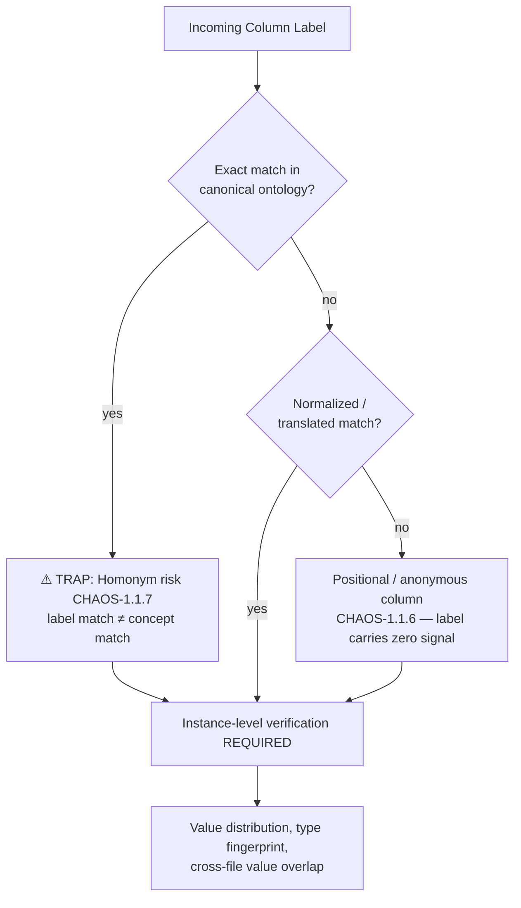
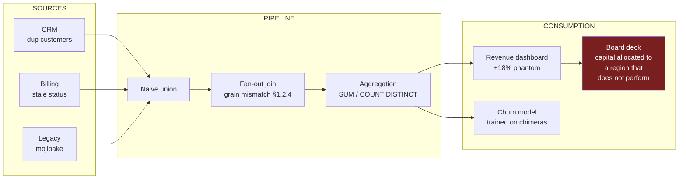

# THREAT_LANDSCAPE_AND_CHAOS_MAP.md
## SchemaPilot — Phase 1: The Threat Landscape & Heterogeneous Chaos
### Enterprise Data Entropy: A Complete Taxonomy of Failure Modes in Un-Unified Multi-Source Corporate Data

| Document Control | |
|---|---|
| **Artifact** | FILE_1 — Threat Landscape & Chaos Map |
| **Status** | Foundational Specification (Pre-Implementation) |
| **Scope** | Diagnostic taxonomy only. No remediation logic (see FILE_2). |
| **Taxonomy ID Scheme** | `CHAOS-<domain>.<class>.<variant>` — every threat in this document carries a stable identifier so FILE_2 countermeasures can reference it. |
| **Severity Model** | §6 — Likelihood × Detectability × Blast Radius |

---

## 0. Executive Framing: The Entropy Problem

Enterprise data does not begin life dirty. It begins life *locally correct* — valid within the assumptions, locale, schema, and operational context of the system that produced it. Chaos emerges at the **moment of confluence**: when N independently-evolved systems, each with its own implicit contract, are merged into a single analytical or operational substrate without a reconciliation layer.

This is the central thesis of this document:

> **Dirty data is not noise added to signal. It is N mutually incompatible signals, each internally coherent, superimposed without a shared coordinate system.**

The consequence is that naive cleaning ("trim whitespace, drop nulls, dedupe exact rows") fails catastrophically at enterprise scale, because the dominant error classes are *semantic* and *structural*, not syntactic. A value can be perfectly formatted and still be wrong; two rows can be byte-level distinct and still describe the same human being; two columns can share a name and mean different things.

The chaos map below is organized into four threat domains:

```
┌─────────────────────────────────────────────────────────────────────────┐
│                       THE FOUR DOMAINS OF DATA CHAOS                     │
├─────────────────────────────────────────────────────────────────────────┤
│  DOMAIN 1: STRUCTURAL        — the shape of the data is wrong            │
│            (schemas clash, columns drift, types pollute)                 │
│  DOMAIN 2: SYNTACTIC         — the encoding of values is wrong           │
│            (formats conflict, characters corrupt, time lies)             │
│  DOMAIN 3: SEMANTIC          — the meaning of the data is wrong          │
│            (entities fragment, rows contradict, references break)        │
│  DOMAIN 4: SYSTEMIC          — the damage propagates invisibly           │
│            (BI poisoning, lineage blindness, ML corruption)              │
└─────────────────────────────────────────────────────────────────────────┘
```

Each domain compounds the previous: structural chaos prevents you from even *aligning* the data; syntactic chaos prevents you from *comparing* values once aligned; semantic chaos prevents you from *trusting* values once compared; systemic chaos ensures that whatever you missed silently destroys downstream value at scale.

---

## 1. DOMAIN 1 — Structural Chaos, Schema Clashing & Semantic Mapping Misalignment

### 1.1 The Silo Genesis Problem (`CHAOS-1.0.*`)

Data silos are not an accident; they are the natural equilibrium of organizational physics. Every silo is a fossil record of a team, an acquisition, a vendor, or an era. Mapping the genesis of silos matters because **the origin of a silo predicts its failure modes**:

| Silo Origin | Typical Carrier Formats | Predicted Chaos Signature | Taxonomy |
|---|---|---|---|
| Legacy mainframe / AS400 export | Fixed-width text, EBCDIC, COBOL copybook dumps | Encoding corruption, packed-decimal artifacts, space-padded keys, implied decimal points | `CHAOS-1.0.1` |
| Departmental spreadsheet culture | `.xlsx`, `.csv` exported by humans | Merged cells flattened into phantom rows, header rows mid-file, regional date/number formats, color-as-data (lost on export) | `CHAOS-1.0.2` |
| Acquired company's CRM/ERP | SQL dumps, API extracts | Parallel ID universes, conflicting reference taxonomies, duplicate customer base with zero shared keys | `CHAOS-1.0.3` |
| SaaS vendor API extracts | JSON/NDJSON, nested documents | Schema-on-read drift, silently versioned payloads, nulls-by-omission vs nulls-by-value ambiguity | `CHAOS-1.0.4` |
| IoT / telemetry streams | Avro, Protobuf, CSV firehose | Clock skew, late/out-of-order arrival, unit drift across firmware versions | `CHAOS-1.0.5` |
| Manual data entry portals | Form submissions → RDBMS | Free-text fields used as structured fields, operator shorthand conventions, copy-paste mojibake | `CHAOS-1.0.6` |
| Regional subsidiaries | Anything, in local language/locale | Cross-lingual schema labels, local calendars (Hijri, Buddhist era), local ID systems (national IDs with different lengths/checksums) | `CHAOS-1.0.7` |

**Why this breaks enterprise systems:** integration projects implicitly assume a *shared conceptual model* across sources. None exists. The same business concept ("customer," "active," "revenue") is operationalized differently per silo, so even a syntactically perfect merge produces a semantically incoherent dataset.

### 1.2 Column Name Misalignment & Cross-Lingual Schema Labels (`CHAOS-1.1.*`)

The same real-world attribute appears under arbitrarily divergent labels across files. This is the **semantic mapping alignment problem**, and it has a precise variation taxonomy:

| Variation Class | Example Set (single concept: *mother's name*) | Mechanism | Taxonomy |
|---|---|---|---|
| Synonymy | `Mother_Name`, `Maternal_Name`, `Mothers_FullName`, `Parent2_Name` | Different teams chose different English words | `CHAOS-1.1.1` |
| Cross-lingual labeling | `اسم الوالدة`, `اسم الأم`, `Nom_de_la_Mère`, `Nombre_Madre` | Regional systems label schemas in local language | `CHAOS-1.1.2` |
| Abbreviation / truncation | `MTH_NM`, `M_NAME`, `MOTHNAME` (8-char legacy limit) | DBMS identifier-length limits, COBOL conventions | `CHAOS-1.1.3` |
| Case & delimiter drift | `motherName`, `mother_name`, `MOTHER-NAME`, `Mother Name` | camelCase vs snake_case vs kebab vs spaces | `CHAOS-1.1.4` |
| Encoding-mangled headers | `اسم الوالدة` (UTF-8 Arabic read as Latin-1) | Header itself suffered mojibake | `CHAOS-1.1.5` |
| Positional anonymity | `Column1`, `F7`, `Unnamed: 3` | Headerless exports; tools synthesize names | `CHAOS-1.1.6` |
| Homonym collision (the inverse trap) | `Name` = mother's name in file A, *applicant's* name in file B | Same label, **different** concept — the deadliest variant because string matching gives a false positive | `CHAOS-1.1.7` |
| Composite vs atomic | `Mother_Full_Name` vs (`Mother_First`, `Mother_Last`) | 1:N column correspondence, not 1:1 | `CHAOS-1.1.8` |
| Unit-embedded labels | `weight_kg` vs `Weight (lbs)` vs `WT` | Label carries unit semantics that must survive mapping | `CHAOS-1.1.9` |

**Critical insight for FILE_2:** classes 1.1.1–1.1.6 are solvable by label-space techniques (normalization, dictionaries, embeddings). Classes 1.1.7–1.1.9 are **only** solvable by *instance-based* evidence — you must look at the values, their distributions, and their cross-file overlap, because the labels actively lie.



### 1.3 Asymmetrical Schemas, Sparse Matrices & Structural Drift (`CHAOS-1.2.*`)

When File A has 14 columns, File B has 22, and File C has 9 — with partial, shifting overlap — naive union produces a **sparse super-schema**:

```
            ┌── File A ──┐┌──── File B ────┐┌─ File C ─┐
  ID        │ ██████████ ││ ██████████████ ││ ████████ │   (universal)
  Name      │ ██████████ ││ ██████████████ ││ ████████ │   (universal)
  Mother_Nm │ ██████████ ││ ░░░░░░░░░░░░░░ ││ ████████ │   (A,C only)
  CreditScr │ ░░░░░░░░░░ ││ ██████████████ ││ ░░░░░░░░ │   (B exclusive)
  LoyaltyTr │ ░░░░░░░░░░ ││ ██████████████ ││ ░░░░░░░░ │   (B exclusive)
  RegionCd  │ ██████████ ││ ░░░░░░░░░░░░░░ ││ ░░░░░░░░ │   (A exclusive)
            └────────────┘└────────────────┘└──────────┘
  ██ = populated     ░░ = structurally absent (NOT the same as null!)
```

The chaos sub-classes:

- **`CHAOS-1.2.1` — Structural absence vs. value absence conflation.** After union, a cell can be empty because (a) the source never had that column (structural null), (b) the source had it but the value was missing (value null), or (c) the value was an explicit "unknown" sentinel. Most pipelines collapse all three into one `NULL`, destroying recoverable information. Downstream imputation then treats "this source could never have known" identically to "this source forgot" — statistically invalid.
- **`CHAOS-1.2.2` — Exclusive-column orphaning.** Columns existing in only one source cannot be cross-validated; they enter the merged dataset with *unverifiable* trust and inherit the full error rate of their single origin.
- **`CHAOS-1.2.3` — Temporal structural drift.** The *same* source changes shape over time: v1 exports had 12 columns, v3 has 17, two were renamed, one changed meaning. Append-based ingestion silently shears columns or shifts them positionally. A monthly CSV feed where a new column was inserted in the middle (not appended) shifts every subsequent column by one position — values land in the wrong fields with **valid types** (a phone number column receiving fax numbers passes every type check).
- **`CHAOS-1.2.4` — Granularity asymmetry.** File A is one-row-per-customer; File B is one-row-per-transaction; File C is one-row-per-customer-per-month. Union or join without grain reconciliation produces fan-out multiplication (§4.1) or silent aggregation loss.

### 1.4 Duplicate Columns & Redundant Rows in Multi-Source Pipelines (`CHAOS-1.3.*`)

**Duplicate columns** arrive through four distinct mechanisms, each requiring different detection:

| Mechanism | Signature | Taxonomy |
|---|---|---|
| Intra-file literal duplication (`Name`, `Name.1`) | Export tool auto-suffixed a repeated header | `CHAOS-1.3.1` |
| Join residue (`addr_x`, `addr_y`) | Upstream merge left both sides' copies; they may now *disagree* | `CHAOS-1.3.2` |
| Derived-column shadowing (`dob`, `age`, `birth_year`) | Same fact at different derivations; they drift out of sync (age computed in 2021, never updated) | `CHAOS-1.3.3` |
| Concept duplication under different labels (`phone`, `mobile`, `contact_no` — 70% identical values) | Three columns that are *mostly* the same attribute with divergent edge population | `CHAOS-1.3.4` |

**Redundant rows** form a severity gradient — and the gradient is the whole problem:

```
EXACT DUPLICATE ──► NEAR DUPLICATE ──► FUZZY DUPLICATE ──► CONFLICTING DUPLICATE
 byte-identical      identical after     same entity,         same entity,
 rows                trivial normaliz.   different surface    MUTUALLY EXCLUSIVE
                     (case, whitespace)  forms (§3.1)         facts (§3.2)
 trivially            cheaply             expensive            unsolvable without
 detectable           detectable          (ER required)        a resolution POLICY
 CHAOS-1.3.5          CHAOS-1.3.6         CHAOS-1.3.7          CHAOS-1.3.8
```

A pipeline that handles only the left end of this gradient (`DISTINCT`) reports "deduplication complete" while the right end — the part that actually corrupts decisions — passes through untouched. Worse, **partial deduplication creates false confidence**: stakeholders are told duplicates were removed.

Additional row-level structural threats:

- **`CHAOS-1.3.9` — Cross-batch re-ingestion.** The same file loaded twice (retry logic, manual re-upload) duplicates *every* row; if any transform between loads changed (timestamp columns, surrogate keys), the duplicates are no longer byte-identical and survive `DISTINCT`.
- **`CHAOS-1.3.10` — Overlapping extraction windows.** Daily extracts pulled with `updated_at >= yesterday` capture rows updated near the boundary twice, in *different versions* — manufacturing conflicting duplicates mechanically.

### 1.5 Type Pollution Within Single Vectors & Target Rejection Mechanics (`CHAOS-1.4.*`)

A single column (vector) that *should* be homogeneous contains a mixture of representations. The canonical pollution classes:

| Pollution Class | Example contents of one "age" / "amount" / "date" column | Taxonomy |
|---|---|---|
| Numeric-as-string contamination | `42`, `"42"`, `"42 "`, `"forty-two"`, `"42 yrs"` | `CHAOS-1.4.1` |
| Sentinel pollution | `42`, `-1`, `999`, `9999`, `0` (where 0 is impossible) — magic numbers as null surrogates | `CHAOS-1.4.2` |
| Null pantheon | `NULL`, `""`, `"N/A"`, `"n.a."`, `"NA"`, `"-"`, `"--"`, `"none"`, `"NIL"`, `"؟"`, `"unknown"`, `"TBD"`, `"#N/A"`, `"#REF!"` | `CHAOS-1.4.3` |
| Locale-split numerics | `1,234.56` and `1.234,56` in the same column — *each parses under the other's locale to a wrong value* | `CHAOS-1.4.4` |
| Spreadsheet artifact leakage | `#VALUE!`, `#DIV/0!`, `=SUM(B2:B9)` as literal text, scientific-notation-mangled IDs (`1.23457E+15`), dates-as-serials (`44927`) | `CHAOS-1.4.5` |
| Boolean babel | `1/0`, `Y/N`, `yes/no`, `TRUE/FALSE`, `T/F`, `نعم/لا`, `-1/0` (Access), `"checked"` | `CHAOS-1.4.6` |
| Mixed-script digits | `٤٢` (Arabic-Indic) alongside `42` (ASCII) — visually a number, fails every ASCII numeric parser | `CHAOS-1.4.7` |
| Precision schizophrenia | Currency stored as float in source A (`19.989999999`), integer cents in source B (`1999`), string in source C (`"$19.99"`) | `CHAOS-1.4.8` |
| Leading-zero amputation | ZIP/phone/account `"00420"` loaded as integer `420` — irreversible information destruction at parse time | `CHAOS-1.4.9` |

**Target database rejection mechanics** — what actually happens when polluted vectors hit a strongly-typed sink, ranked from *loud* to *catastrophically silent*:

| Sink Behavior | Mechanism | Failure Mode | Severity |
|---|---|---|---|
| Hard transactional abort | `INSERT` fails, whole batch rolls back | Pipeline halts at 3 AM; one bad row in 50M blocks everything; on-call paged | Loud (good!) |
| Row-level rejection to error table | Bad rows siphoned to a reject file | Reject file grows unmonitored for months; dataset develops **survivorship bias** — analysis runs only on rows clean enough to load | Quiet |
| Implicit coercion | DB silently casts `"42 yrs"` → `NULL` or truncates `VARCHAR` overflow | Values mutate at the threshold with zero error signal | Silent |
| Schema-on-read deferral | Data lake accepts everything; failure deferred to *every future query* | Each consumer independently rediscovers and independently mis-handles the pollution; N divergent ad-hoc fixes | **Catastrophic** |
| Type widening capitulation | Loader auto-degrades column to `VARCHAR` to make errors stop | All typed semantics lost; every downstream consumer must now parse; comparisons become lexicographic (`"9" > "10"`) | **Catastrophic** |

The last two rows are the dominant enterprise pattern: the path of least resistance converts a visible structural problem into an invisible semantic one.

---

## 2. DOMAIN 2 — Formatting, Syntactic Noise & Temporal Discrepancies

### 2.1 The Datetime Conflict Matrix (`CHAOS-2.1.*`)

Temporal data is the single most dangerous syntactic domain because **ambiguous values parse successfully into wrong answers**. The threat is not parse failure — it is silent mis-parse.

**`CHAOS-2.1.1` — Format ambiguity (the DD/MM ↔ MM/DD trap).** Within one column:

```
 03/04/2024   ← ambiguous: April 3 (EU) or March 4 (US)?  BOTH PARSE.
 13/04/2024   ← unambiguous: must be DD/MM (no month 13)
 04-13-2024   ← unambiguous: must be MM-DD
 2024-04-03   ← ISO 8601, unambiguous
 03/04/24     ← ambiguous in THREE fields (century? day? month?)
```

A column where 8% of values are day>12 (unambiguous) and 92% are ≤12 (ambiguous) gives you a *statistical* signature of the true format — but a column **mixing** formats (because two regional offices appended to the same file) makes per-value disambiguation formally undecidable without external evidence. Up to ~36% of day/month pairs are silently transposable; every transposed date is a *plausible* date.

| Variant | Threat | Taxonomy |
|---|---|---|
| Two-digit year pivoting | `47` → 1947 or 2047? Pivot rules differ per parser (Excel: 30, .NET: 50, ad hoc: ∞) | `CHAOS-2.1.2` |
| Epoch unit confusion | `1700000000` (seconds), `1700000000000` (ms), `…000000` (µs); off by 1000× lands you in 55966 AD or 1970 | `CHAOS-2.1.3` |
| Spreadsheet serial dates | `44927` = 2023-01-01 in Excel-1900, but 2027-01-02 in Excel-1904 (legacy Mac); plus the fictitious 1900-02-29 Lotus bug offset | `CHAOS-2.1.4` |
| Calendar system mixing | Hijri `1445/09/15` vs Gregorian `2024/03/25` in one regional dataset; Hijri years are ~3% shorter — drift compounds | `CHAOS-2.1.5` |
| Month-name locale | `Mar`, `Mär`, `mars`, `مارس`, `03` | `CHAOS-2.1.6` |
| Sentinel dates | `1900-01-01`, `1970-01-01`, `9999-12-31`, `0000-00-00` — nulls disguised as the oldest/newest record, poisoning min/max and recency-based conflict resolution (a direct attack on FILE_2's recency strategy) | `CHAOS-2.1.7` |

**`CHAOS-2.1.8` — Timezone loss and naive-datetime laundering.** The most destructive temporal failure:

```
   Source A (Dubai):    2024-03-10 02:30:00          (naive; was GST +04:00)
   Source B (NY):       2024-03-10 02:30:00          (naive; was EST −05:00)
   Source C (system):   2024-03-10T02:30:00Z         (true UTC)
                              │
                              ▼  merged as equal — actually span 9 hours
   ┌────────────────────────────────────────────────────────────────┐
   │ Consequences:                                                  │
   │ • Event ordering inverted → causality analysis wrong           │
   │ • "Last-write-wins" conflict resolution picks the LOSER        │
   │ • Daily aggregation buckets shift across midnight boundaries   │
   │ • 2024-03-10 02:30 EST is INSIDE the DST spring-forward gap —  │
   │   a timestamp that never existed on any wall clock             │
   └────────────────────────────────────────────────────────────────┘
```

Once timezone metadata is stripped (CSV export is the usual murder weapon), it is **unrecoverable from the value alone** — only source-level provenance can restore it. DST adds the twin pathologies of *nonexistent* times (spring gap) and *ambiguous* times (fall repeat: 01:30 occurs twice).

- **`CHAOS-2.1.9` — Clock skew & future-dated records.** IoT devices and mis-set servers produce events timestamped in the future or before device manufacture, breaking recency-based survivorship and windowed joins.

### 2.2 Character Encoding Corruption — The Mojibake Pathology (`CHAOS-2.2.*`)

Encoding corruption is **transformational**, not random: each corruption is a deterministic function of (true encoding, assumed encoding), which means it is *partially reversible if detected* and *compoundingly destructive if not*.

| Corruption Class | Signature | Example | Taxonomy |
|---|---|---|---|
| Single mis-decode | UTF-8 bytes read as Latin-1/Windows-1252 | `محمد` → `Ù…Øمد`; `José` → `José` | `CHAOS-2.2.1` |
| Double encoding | Mis-decoded text re-encoded as UTF-8, possibly repeatedly | `é` → `é` → `é` → `é` (each round-trip multiplies bytes) | `CHAOS-2.2.2` |
| Replacement-character destruction | Lossy decode substituted `�` (U+FFFD) or `?` | `محمد` → `????` — **irreversible**; all distinct Arabic names collapse to the same string of `?`, manufacturing false duplicate matches | `CHAOS-2.2.3` |
| BOM contamination | `` prefixing first header | First column named `ID` silently becomes `ID` — every exact-match lookup on it fails | `CHAOS-2.2.4` |
| Normalization form divergence | NFC vs NFD: `é` as one codepoint vs `e`+combining accent | Visually identical, byte-distinct → join keys fail, duplicates survive | `CHAOS-2.2.5` |
| Confusable/homoglyph substitution | Cyrillic `о` (U+043E) vs Latin `o`; Arabic `ي` vs Farsi `ی`; `ك` vs `ک` | Invisible to humans, fatal to exact matching; Arabic letter variants split one name into N "distinct" strings | `CHAOS-2.2.6` |
| Invisible character injection | Zero-width space/joiner (U+200B/200D), NBSP (U+00A0), RTL/LTR marks (U+200E/200F) from copy-paste | `"Acme Corp"` ≠ `"Acme​ Corp"`; trailing NBSP survives `TRIM()` implementations that only strip ASCII 0x20 | `CHAOS-2.2.7` |
| Bidi scrambling | RTL text concatenated with LTR identifiers without isolation marks | Stored field order ≠ displayed order; humans "verify" a value whose logical order differs from what they see | `CHAOS-2.2.8` |

**Compounding law:** mojibake interacts multiplicatively with entity resolution (§3.1). `Mohammed` vs `Ù…Øمد` is not a fuzzy-match problem — no string distance metric bridges an encoding corruption. Encoding repair is therefore a **strict prerequisite** of entity resolution, an ordering constraint FILE_2 must enforce architecturally.

### 2.3 Linguistic Variance & Free-Form Field Fragmentation (`CHAOS-2.3.*`)

- **`CHAOS-2.3.1` — Address anti-structure.** Addresses arrive as: single free-text blob (`"Bldg 7, Apt 3B, King Fahd Rd, Riyadh 11564 KSA"`), inconsistently split components (`addr1/addr2/city/zip` with city in `addr2` half the time), abbreviation chaos (`St/St./Str/Street`; `شارع/ش`), ordering conventions that differ per country (house-first vs street-first), and vanity/translated place names (`Jeddah/Jiddah/جدة`). The same physical location yields dozens of surface forms; no field-level equality test will ever unify them.
- **`CHAOS-2.3.2` — Name field abuse.** `Name` columns containing: full names, "LAST, First" inversions, titles (`Dr.`, `Eng.`, `الشيخ`), suffixes, parenthetical aliases (`Robert (Bob) Smith`), two people (`"Ali & Fatima Hassan"`), or businesses in a person field. Patronymic chains in Arabic naming (`محمد بن عبدالله بن سعيد آل فلان`) have no stable first/last decomposition — Western `first_name/last_name` schemas structurally mangle them at entry time.
- **`CHAOS-2.3.3` — Phone number formatting explosion.** `+966 50 123 4567`, `0501234567`, `00966501234567`, `(050) 123-4567`, `501234567` — one subscriber, five forms, plus extension suffixes (`x204`) and multiple numbers jammed in one cell (`"050…/056…"`).
- **`CHAOS-2.3.4` — Categorical value drift.** Status column accumulates `Active`, `ACTIVE`, `active `, `A`, `Act.`, `1`, `actif`, `نشط` across sources and eras. Category cardinality inflates from 4 true states to 30+ surface states; every `GROUP BY` fragments.
- **`CHAOS-2.3.5` — Unit ambiguity without unit columns.** `weight = 80` (kg or lbs?), `distance = 5` (km or mi?), `amount = 1000` (SAR, USD, fils, halalas?). The value is meaningless without the unit, and the unit lives only in tribal knowledge or a column label (`CHAOS-1.1.9`).

### 2.4 The Null Pantheon — A Unified View (`CHAOS-2.4.1`)

Missingness itself is typed, and conflating the types is an analytical error class of its own:

| Missingness Type | Meaning | Example surface form | Correct downstream treatment |
|---|---|---|---|
| Structural | Source schema never had the field | absent column (§1.3 union) | Exclude from denominators entirely |
| Not-applicable | Field meaningless for this entity | `maiden_name` for male record | Exclude; do **not** impute |
| Unknown-unknown | Value exists in reality, never captured | `""`, `NULL` | Candidate for imputation/fusion |
| Refused / withheld | Subject declined | `"DECLINED"`, sometimes blank | Legally distinct (consent); never impute |
| Pending | Value will exist later | `"TBD"`, sentinel date | Temporal hold, not absence |
| Erased | Value deleted (GDPR/right-to-be-forgotten) | blank where history shows a value | **Must not be re-imputed or re-fused from another source** — re-deriving erased PII is a compliance violation |

The last row is a non-obvious legal trap: a fusion engine that "helpfully" fills a GDPR-erased phone number from a sibling source has re-identified a subject who exercised erasure rights.

---

## 3. DOMAIN 3 — Semantic Contradictions, Identity Resolution & Entity Duplication

### 3.1 Fuzzy Duplicates & The Transliteration Explosion (`CHAOS-3.1.*`)

A single real-world person fragments into many surface records. The fragmentation channels:

**`CHAOS-3.1.1` — Phonetic/orthographic variation (intra-script).**
`Mohammad / Mohammed / Muhammad / Mohamed / Muhammed / Mohamad / Mhd.` — all Latin renderings of `محمد`. There is no authoritative spelling; each is a lossy phonetic projection. Arabic→Latin transliteration is **many-to-many**: one Arabic name yields 10–30 attested Latin forms; conversely one Latin form (`Said`) maps back to multiple distinct Arabic names (`سعيد` Sa'id vs `صائد` — different people).

**`CHAOS-3.1.2` — Cross-script identity.** The same person appears as `محمد عبد الله` in the HR system and `Mohammed Abdullah` in the CRM. No string-distance metric operates across scripts; this requires transliteration-space or phonetic-space projection (FILE_2 §4) — a fundamentally different algorithm class than Levenshtein.

**`CHAOS-3.1.3` — Arabic-internal orthographic variance.** Even within Arabic script, one name has multiple legitimate byte forms:
- Hamza/alef variants: `أحمد` vs `احمد` (with/without hamza on alef)
- Ta marbuta vs ha: `فاطمة` vs `فاطمه`
- Alef maqsura vs ya: `مصطفى` vs `مصطفي`
- Diacritics present/absent: `مُحَمَّد` vs `محمد`
- Definite-article and particle joining: `عبدالله` vs `عبد الله`; `آل سعود` vs `السعود`

**`CHAOS-3.1.4` — Structural name variation.** Token reordering (`Smith, John` / `John Smith`), middle-name presence/absence, initialism (`J. R. Smith`), marriage-driven surname change over time (same entity, *legitimately* different name at different timestamps — a variation that recency must resolve, not string similarity).

**`CHAOS-3.1.5` — Typographic noise.** Keyboard-adjacency errors, OCR confusions (`rn`↔`m`, `l`↔`1`, `O`↔`0`), doubled letters, swapped characters — the classical edit-distance regime.

**The combinatorial detection problem:** naive pairwise comparison of n records is O(n²) — 50M records → 1.25×10¹⁵ pairs. This is not an inconvenience; it is the *reason* enterprises don't dedupe, and the reason FILE_2 must treat blocking/indexing as a first-class architectural layer rather than an optimization.

### 3.2 Data Contradiction & Row Conflict Mechanics (`CHAOS-3.2.*`)

The hardest class: duplicate rows that have been *correctly* identified as the same entity, but which assert **mutually exclusive facts**. This is no longer a detection problem — it is a *truth* problem.

**Canonical collision scenario:**

| Field | Source A (CRM, updated 2024-01) | Source B (Billing, updated 2024-06) | Source C (Legacy import, 2019) |
|---|---|---|---|
| Name | Mohammed Al-Rashid | Mohamed Alrashid | محمد الراشد |
| Phone | +966 50 111 2222 | +966 50 999 8888 | 050 111 2222 |
| Address | Riyadh, Olaya St. | Jeddah, Corniche Rd. | الرياض، شارع العليا |
| Status | ACTIVE | CHURNED | active |
| DOB | 1985-03-04 | 1985-04-03 | 04/03/1985 |

Every field disagrees, yet this is **one person**. Dissecting the conflict types embedded here:

| Conflict Class | Definition | Example above | Resolution requires | Taxonomy |
|---|---|---|---|---|
| Representational conflict | Same fact, different surface form | Name across all three; phone A vs C | Normalization only — *not a real conflict* | `CHAOS-3.2.1` |
| Temporal staleness conflict | Both values were true; one is outdated | Address (he moved Riyadh→Jeddah); Status | Recency + source freshness metadata | `CHAOS-3.2.2` |
| Genuine multiplicity | Both values are simultaneously true | Phone (work + personal) | Schema change: the attribute is multi-valued, conflict is *illusory* | `CHAOS-3.2.3` |
| Error conflict | One value is simply wrong | DOB (day/month transposition — note 03-04 vs 04-03 is exactly `CHAOS-2.1.1` leaking upward) | Source reliability estimation, validation rules | `CHAOS-3.2.4` |
| Granularity conflict | Values at different precision | `Riyadh` vs `Riyadh, Olaya St.` | Specificity lattice — more-specific subsumes less-specific *if consistent* | `CHAOS-3.2.5` |
| Semantic frame conflict | Same label, different definition per source | `Status=ACTIVE`: CRM means "engaged in 90d," Billing means "has unpaid subscription" | Ontology reconciliation — values are **incomparable** until definitions align | `CHAOS-3.2.6` |
| Identity-error conflict | The "conflict" exists because ER over-merged two different people | (latent risk in every cell) | Conflict magnitude itself must feed back as evidence *against* the merge | `CHAOS-3.2.7` |

**`CHAOS-3.2.7` deserves emphasis as the system's most important feedback loop:** wildly contradictory attributes are evidence the entity-resolution step made a false-positive merge. A conflict-resolution layer that blindly "picks a winner" between two *different people's* addresses manufactures a chimera record — a synthetic entity that exists nowhere in reality but now sits in the SSOT with maximum institutional trust. **Chimera records are the worst possible output of a cleaning pipeline: they are wrong, confident, and untraceable.**

### 3.3 Broken Referential Integrity (`CHAOS-3.3.*`)

| Failure | Mechanism | Taxonomy |
|---|---|---|
| Orphaned children | `orders.customer_id = 88412` but no such customer (deleted, never migrated, or lives in a sibling silo's ID space) | `CHAOS-3.3.1` |
| Dangling references after partial loads | Parent table load failed at row 3M; children loaded fully — integrity broken by *operational ordering*, not by data | `CHAOS-3.3.2` |
| Parallel ID universes | Acquired company's `customer_id=1001` collides with incumbent's `customer_id=1001` — different people; naive union welds two identities together (instant `CHAOS-3.2.7` chimeras at scale) | `CHAOS-3.3.3` |
| Recycled keys | Source system reuses IDs of deleted entities; historical fact tables now point at the *new* occupant of the ID | `CHAOS-3.3.4` |
| Cardinality violations | "Each customer has exactly one primary address" — merged data shows 0 for some, 4 for others | `CHAOS-3.3.5` |
| Cross-source FK type mismatch | Key is `INT` in source A, zero-padded `CHAR(10)` in source B (`420` vs `"0000000420"`) — referentially identical, mechanically unjoinable; compounded by `CHAOS-1.4.9` | `CHAOS-3.3.6` |

### 3.4 Physical & Business Logic Violations (`CHAOS-3.4.*`)

Values that are well-typed, well-formatted, and **impossible**:

- **`CHAOS-3.4.1` — Physical impossibility:** age 212; DOB in the future; `hire_date < birth_date`; latitude 94.7; negative quantity shipped; delivery before order; (0,0) "Null Island" coordinates clustering thousands of "customers" in the Gulf of Guinea.
- **`CHAOS-3.4.2` — Business-rule violation:** discount > 100%; order total ≠ Σ line items; `end_date < start_date`; VIP-tier customer with zero lifetime transactions; salary outside band by 100×.
- **`CHAOS-3.4.3` — Cross-field incoherence:** `country = "Saudi Arabia"` with `zip = "90210"`; `marital_status = single` with populated `spouse_name`; `status = CLOSED` with transactions after closure date.
- **`CHAOS-3.4.4` — Distributional impossibility:** values individually plausible, collectively absurd — 40% of customers born exactly 1990-01-01 (form default), Benford's-law violation in financial amounts (fabrication signature), 9,000 transactions at exactly 00:00:00 (timestamp truncation upstream).

Class 3.4.4 is critical: it is invisible to row-level validation. **Only population-level statistical profiling detects it**, which constrains FILE_2's validation architecture to operate at both grains.

---

## 4. DOMAIN 4 — Pipeline Poisoning: Silent Propagation Mechanics

The first three domains describe *what is wrong*. This domain describes **how wrongness travels** — the amplification topology that turns one dirty source into enterprise-wide misinformation.

### 4.1 Executive BI Corruption Mechanics (`CHAOS-4.1.*`)



- **`CHAOS-4.1.1` — Fan-out multiplication.** A join key duplicated on one side multiplies measures on the other: a customer present 3× (unresolved fuzzy duplicates, §3.1) triples their attributed revenue. The dashboard total is *plausible* — 18% high, not 300% high — so it passes the executive sniff test. **Plausible-magnitude errors are the most dangerous; absurd errors get caught.**
- **`CHAOS-4.1.2` — `COUNT(DISTINCT)` inflation/deflation.** Unresolved duplicates inflate customer counts (KPIs overstate reach); over-aggressive dedup or `CHAOS-2.2.3` replacement-character collapse *deflates* them. Both directions corrupt growth metrics that drive compensation and capital allocation.
- **`CHAOS-4.1.3` — Filter shear.** Categorical drift (`CHAOS-2.3.4`) means `WHERE status = 'ACTIVE'` silently excludes the `'Active '`, `'A'`, and `'نشط'` populations. Different analysts apply different filters → **two dashboards, same warehouse, different revenue numbers** → organizational trust in *all* data collapses ("dueling dashboards" syndrome). The political damage outlives the technical fix.
- **`CHAOS-4.1.4` — Sentinel skew.** `9999-12-31` sentinel dates make "average customer tenure" report 5,900 years until someone clips them — then the clip threshold itself becomes an undocumented analytical decision that varies per analyst.
- **`CHAOS-4.1.5` — Slow drift below alert thresholds.** Each load introduces 0.1% corruption; monitoring alerts at 5% deltas. Eighteen months later the metric is 40% off and **no single change is identifiable as the cause** — the corruption has no diff to bisect.

### 4.2 Data Lineage Blindness (`CHAOS-4.2.*`)

- **`CHAOS-4.2.1` — Provenance amnesia.** Once sources are unioned without source-tagging, the question "which system did this bad value come from?" becomes unanswerable. Remediation cost explodes from "fix one source extractor" to "audit everything."
- **`CHAOS-4.2.2` — Transformation laundering.** Each pipeline hop (staging → conformed → mart) re-keys, re-casts, and re-names. By hop 4, a corrupted value is dressed in fresh surrogate keys and a clean schema — it *looks* like first-class data. Lineage metadata, if it exists at all, tracks tables, not values.
- **`CHAOS-4.2.3` — Cleaning without receipts.** Ad-hoc cleanup scripts (the analyst's notebook that "fixed the dates") transform data with no record of what changed. The original is overwritten. When the fix is later found wrong, **there is no undo** — this is why FILE_2 mandates immutable raw zones and reversible transforms as architectural axioms, not nice-to-haves.

### 4.3 ML Training Loop Corruption (`CHAOS-4.3.*`)

| Poisoning Vector | Mechanism | Consequence | Taxonomy |
|---|---|---|---|
| Label noise from conflicts | `status` used as churn label; `CHAOS-3.2.2` staleness means ~12% of labels are wrong, *non-randomly* (biased toward stale sources/regions) | Model learns the bias of the slowest source system; performance ceiling silently capped | `CHAOS-4.3.1` |
| Duplicate leakage across splits | Fuzzy duplicates of one entity land in both train and test | Validation metrics inflated; model memorizes, doesn't generalize; the gap appears only in production | `CHAOS-4.3.2` |
| Sentinel features | `-1` / `9999` magic numbers ingested as real numeric features | Tree models split on sentinels and learn "missingness archaeology" instead of signal — accidentally effective until a source fixes its sentinels, then silent collapse | `CHAOS-4.3.3` |
| Encoding-fractured categoricals | `محمد` / `Mohammed` / `Ù…Øمد` as three embedding rows | Signal dilution across fragments; minority-script populations systematically underfit → **algorithmic bias with regulatory exposure** | `CHAOS-4.3.4` |
| Imputation feedback loops | Model-imputed values written back to the warehouse, later consumed as ground truth by the next model generation | Self-reinforcing hallucination; uncertainty laundered into fact; compounds per retraining cycle | `CHAOS-4.3.5` |
| Train/serve skew | Training data cleaned by offline pipeline; serving features computed from raw sources with none of the cleaning | Model sees a distribution at inference it never saw in training; accuracy drop invisible to offline eval | `CHAOS-4.3.6` |

### 4.4 The Propagation Topology — Why It Stays Silent

```
  Defect severity
  (cost to fix)
      ▲
      │                                                    ██ Board decision
      │                                          ██ Dashboards/Models
      │                              ██ Marts
      │                  ██ Conformed layer
      │       ██ Staging
      │ ██ Source
      └──────────────────────────────────────────────────► Pipeline depth
        DETECTION probability decays ◄──────────────────
        REMEDIATION cost compounds   ──────────────────►
```

Three structural reasons the poisoning is silent:

1. **Validation asymmetry.** Type/format checks live at ingestion (where errors are syntactic); semantic errors crystallize *later* (post-join, post-aggregation) where no checks live.
2. **Aggregation anonymization.** A `SUM()` over 50M rows has no mechanism to report that 2M contributing values were sentinels. Aggregates are confidence-laundering machines.
3. **Organizational distance.** The person who can *see* the error (analyst staring at a weird number) is 4 teams away from the person who can *explain* it (source-system DBA) and 6 away from the one who can *fix* it. The cheapest local action is to hand-adjust the number in the deck — which is the final, human-layer corruption: `CHAOS-4.4.1`, **the spreadsheet shadow-correction economy**, where the organization's true SSOT becomes a folder of manually patched XLSX files that no pipeline can see.

---

## 5. Cross-Domain Interaction Map — Compound Threats

Individual threats are tractable; **compounds** are what kill pipelines. The highest-risk interaction chains observed in tier-1 environments:

| Compound Chain | Mechanics | Net Effect |
|---|---|---|
| `2.2.1 → 3.1.2 → 1.3.8` | Mojibake breaks string similarity → fuzzy dupes survive ER → contradictions never even *detected* | Entity universe permanently fragmented |
| `2.1.1 → 3.2.4 → fusion` | Date transposition manufactures DOB conflicts → conflict resolver "resolves" between a right and a wrong value with 50/50 odds | SSOT certifies coin-flips as truth |
| `1.1.7 → 2.x → 3.2.6` | Homonym columns merged → incomparable value populations mixed → semantic frame conflicts misdiagnosed as data errors | Cleaning effort spent "fixing" correct data |
| `1.4.9 → 3.3.6 → 4.1.1` | Leading zeros stripped → FK joins partially fail → surviving joins fan out | Referential graph silently amputated AND inflated simultaneously |
| `3.3.3 → 3.2.7 → 4.3.1` | ID-universe collision → chimera entities → chimeras become ML training labels | Models trained on people who don't exist |
| `2.1.7 → FILE_2 recency strategy` | Sentinel date `9999-12-31` outranks every legitimate timestamp in last-write-wins fusion | **The cleaning algorithm itself is weaponized by the dirt it ingests** — sentinel-poisoned recency is an adversarial input to FILE_2 §5 and must be neutralized before fusion |

The final row is the document's closing warning to the architecture phase: **every resolution strategy in FILE_2 has a chaos class in FILE_1 that, untreated, inverts it.** Recency is poisoned by sentinel dates; majority voting is poisoned by re-ingestion duplication (`CHAOS-1.3.9` lets one source vote three times); source-authority ranking is poisoned by transformation laundering (`CHAOS-4.2.2` makes the dirtiest data look freshest). The architecture must therefore sequence syntactic decontamination *strictly before* any truth-discovery logic.

---

## 6. Severity & Risk Scoring Model

Every taxonomy entry is scored on three orthogonal axes (1–5 each); composite risk = L × (6 − D) × B, range 1–125:

- **L — Likelihood:** frequency of occurrence in a typical 10+ source enterprise merge.
- **D — Detectability:** how loudly it fails (5 = hard crash at ingest; 1 = invisible until board meeting). *Inverted* in the formula: silence is risk.
- **B — Blast radius:** scope of downstream damage (1 = single field; 5 = enterprise-wide decision corruption).

### Top-tier risks (composite ≥ 60) — the architecture's priority targets

| Rank | Threat | L | D | B | Risk | Why it tops the list |
|---|---|---|---|---|---|---|
| 1 | `CHAOS-3.2.7` chimera merges | 3 | 1 | 5 | 75 | Wrong, confident, untraceable; corrupts SSOT at its core promise |
| 2 | `CHAOS-2.1.1` date ambiguity | 5 | 1 | 3 | 75 | Universal, parses "successfully," corrupts temporal logic and fusion |
| 3 | `CHAOS-4.1.1` fan-out multiplication | 4 | 2 | 5 | 80 | Plausible-magnitude financial misstatement |
| 4 | `CHAOS-1.1.7` homonym columns | 3 | 1 | 4 | 60 | Defeats label-based matching; poisons everything downstream of mapping |
| 5 | `CHAOS-3.3.3` ID-universe collision | 3 | 2 | 5 | 60 | Mass chimera manufacture in one operation |
| 6 | `CHAOS-2.2.x` encoding corruption family | 5 | 3 | 4 | 60 | Prerequisite-breaker: blocks ER, fragments categoricals, biases ML |
| 7 | `CHAOS-2.1.8` timezone loss | 4 | 1 | 3 | 60 | Unrecoverable from values; inverts recency-based truth discovery |

### Full-taxonomy risk register (abridged scoring; all entries L/D/B-scored in the master register)

| Domain | Entries | Highest-risk member | Dominant detection grain |
|---|---|---|---|
| 1 Structural | `CHAOS-1.0.1`–`1.4.9` (23 classes) | `1.1.7` homonyms | Column-level profiling + cross-file instance evidence |
| 2 Syntactic | `CHAOS-2.1.1`–`2.4.1` (19 classes) | `2.1.1` date ambiguity | Value-level parsing + column-level format census |
| 3 Semantic | `CHAOS-3.1.1`–`3.4.4` (17 classes) | `3.2.7` chimeras | Pairwise/cluster-level + population statistics |
| 4 Systemic | `CHAOS-4.1.1`–`4.4.1` (13 classes) | `4.1.1` fan-out | Aggregate reconciliation + lineage audit |

---

## 7. Closing Statement of the Threat Phase

The chaos mapped above admits one unifying conclusion that dictates everything in FILE_2:

> **No single technique class survives contact with this landscape.** Label matching dies on homonyms; string distance dies on cross-script identity; recency dies on sentinel dates; voting dies on re-ingestion; rules die on distributional anomalies; statistics die on small categorical domains. The only viable architecture is a *layered evidence engine* in which every decision — column mapping, entity merge, value survival — is made by combining multiple independent evidence channels, carries an explicit confidence, remains reversible against an immutable raw record, and escalates to human adjudication exactly when (and only when) evidence channels disagree.

That engine is specified in **FILE_2: ALGORITHMIC_ARCHITECTURE_AND_SSOT_BLUEPRINT.md**.
